# LinkedIn MCP Server - Comprehensive Repository Analysis

*Analysis Date: June 5, 2025*

## Executive Summary

This repository contains a sophisticated **LinkedIn Comments Scraper MCP Server** built on the Model Context Protocol (MCP) architecture. The system leverages FastMCP, Playwright browser automation, and Google Gemini AI to extract structured data from LinkedIn posts and profiles. The codebase demonstrates modern Python practices with strong emphasis on modularity, error handling, and cloud deployment readiness.

---

## 📊 Repository Overview

### Key Metrics
- **Primary Language**: Python 3.11+
- **Architecture Pattern**: MCP (Model Context Protocol) Server
- **Dependencies**: 48 packages
- **Core Technologies**: FastMCP, Playwright, Google Gemini AI, Pandas
- **Deployment**: Docker containerized, cloud-ready
- **Lines of Code**: ~550 lines (server.py)

### Core Capabilities
1. **LinkedIn Post Comments Scraping** - Extract emails and user data from post comments
2. **LinkedIn Profile Data Extraction** - Comprehensive profile information using AI
3. **Health Check Monitoring** - Server health verification
4. **Cloud Deployment Ready** - Docker containerization and environment configuration

---

## 🏗️ Software Architecture Analysis

### System Architecture Overview

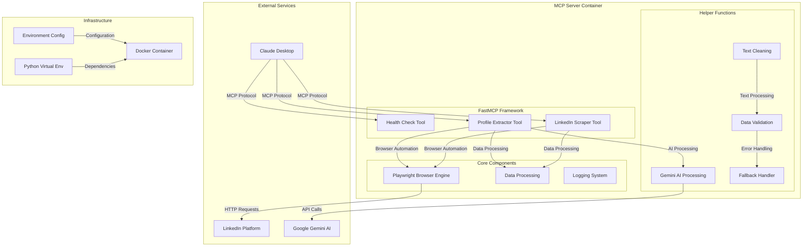

### Component Architecture

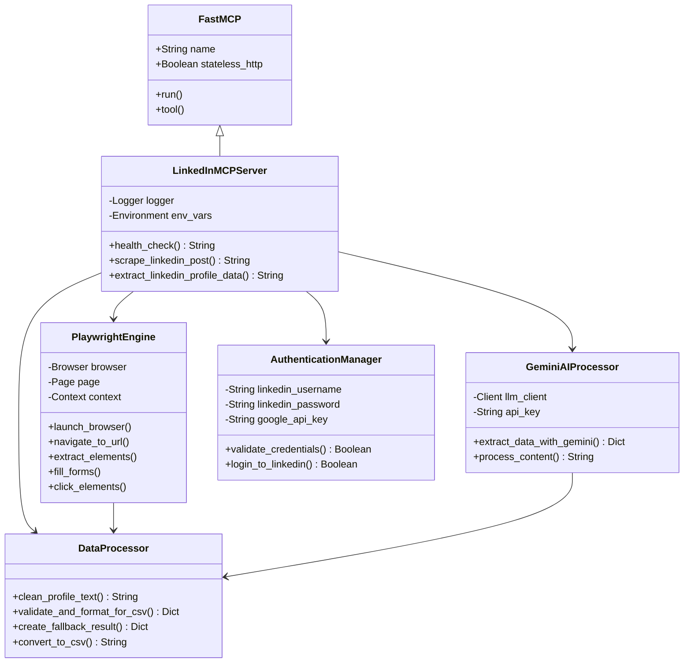

### Data Flow Architecture

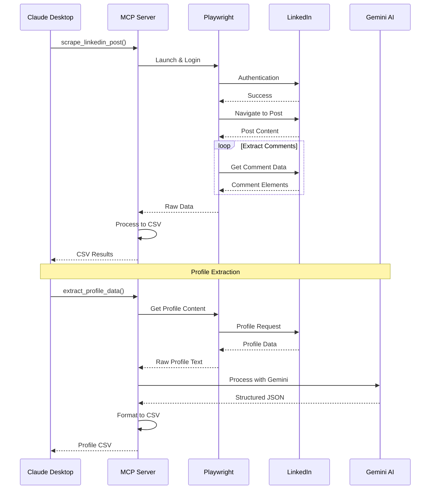

---

## 💻 Developer Analysis

### Code Quality Assessment

#### Strengths
1. **Comprehensive Error Handling**: Extensive try-catch blocks with proper cleanup
2. **Modular Design**: Well-separated concerns with helper functions
3. **Robust Logging**: Detailed logging for debugging and monitoring
4. **Type Hints**: Proper Python type annotations throughout
5. **Documentation**: Comprehensive docstrings for all functions
6. **Configuration Management**: Environment-based configuration
7. **Async Programming**: Proper async/await patterns

#### Technical Debt & Areas for Improvement

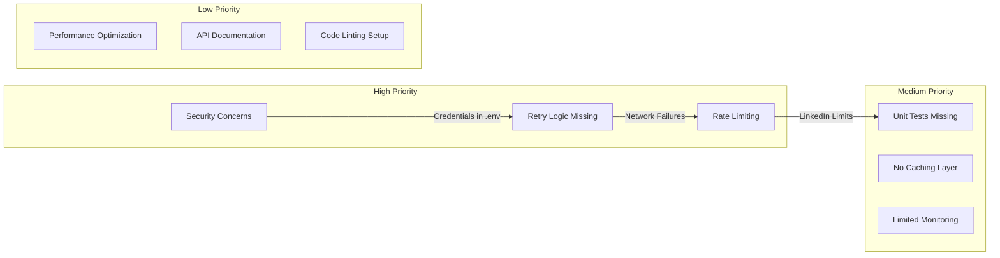

### Security Analysis

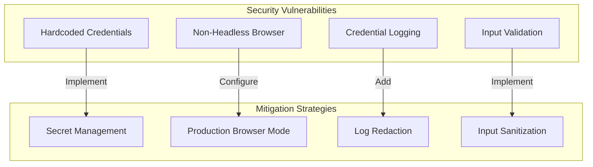

### Code Structure Analysis

#### File Organization
```
src/
├── server.py          # Main MCP server implementation (549 lines)
├── main.py           # Alternative entry point for uvicorn (22 lines)
└── __init__.py       # Package initialization (2 lines)
```

#### Function Complexity Analysis
- **`scrape_linkedin_post()`**: 180+ lines - High complexity, needs refactoring
- **`extract_linkedin_profile_data()`**: 100+ lines - Medium-high complexity
- **`_extract_data_with_gemini()`**: 80+ lines - Medium complexity
- **Helper functions**: 10-50 lines each - Appropriate complexity

#### Dependencies Analysis

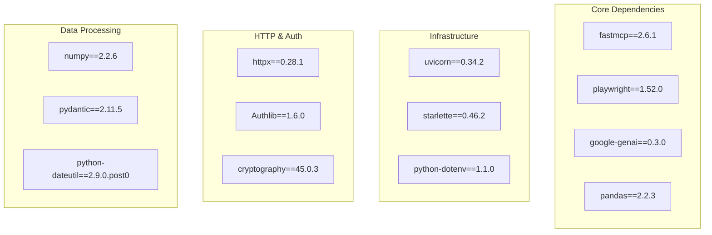

---

## 📋 Product Manager Analysis

### Feature Inventory & Business Value

#### Current Features

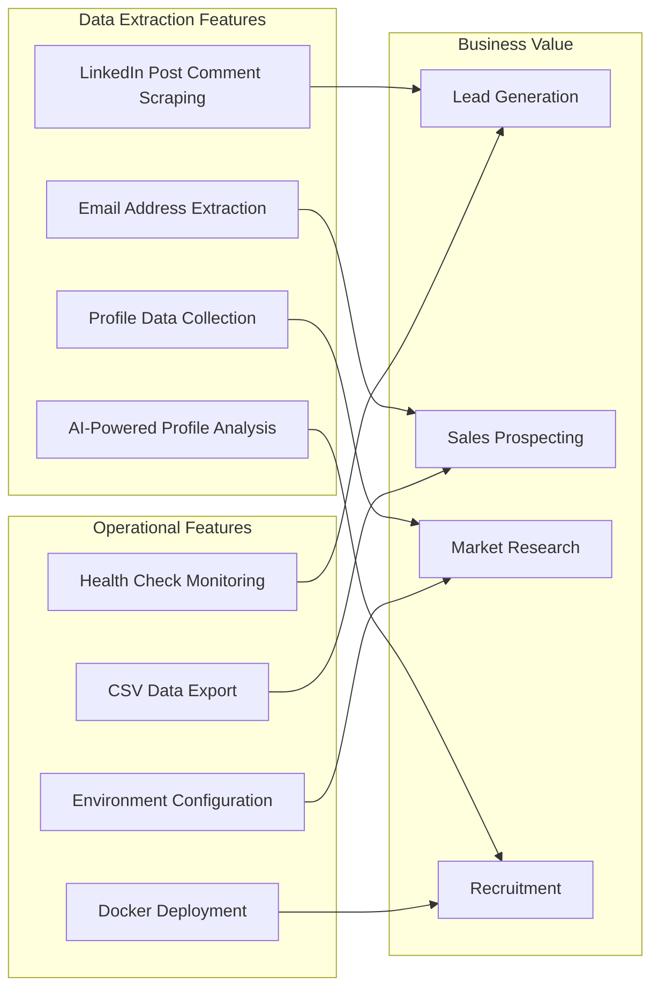

#### Feature Comparison Matrix

| Feature | Complexity | Business Value | Development Effort | Priority |
|---------|------------|----------------|--------------------|----------|
| Comment Scraping | High | High | Complete | P0 |
| Email Extraction | Medium | Very High | Complete | P0 |
| Profile Analysis | Very High | High | Complete | P0 |
| Health Monitoring | Low | Medium | Complete | P1 |
| CSV Export | Low | High | Complete | P1 |
| Docker Deployment | Medium | Medium | Complete | P1 |

### User Journey Analysis

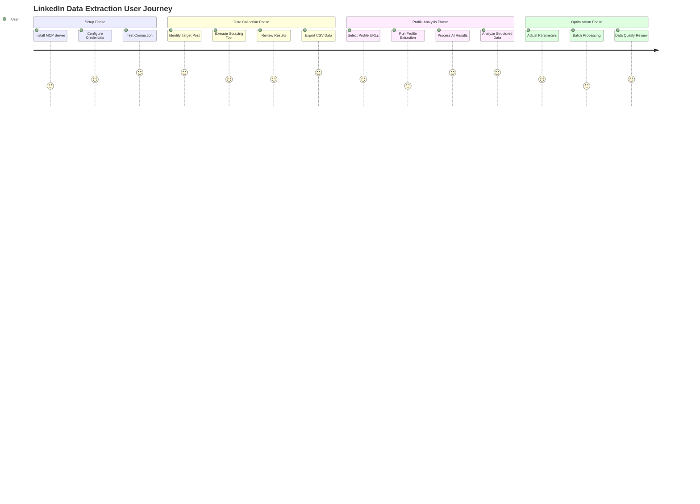

### Competitive Analysis & Market Position

#### Strengths
- **AI-Powered Extraction**: Unique Gemini AI integration for structured data
- **MCP Protocol**: Modern architecture for AI tool integration
- **Comprehensive Data**: Both comments and full profile extraction
- **Cloud Ready**: Docker containerization and production deployment

#### Market Opportunities
1. **Enterprise Sales Tools**: Integration with CRM systems
2. **Recruitment Platforms**: Automated candidate sourcing
3. **Market Research**: Automated lead generation and analysis
4. **Social Media Analytics**: Content engagement analysis

### Technical Roadmap Recommendations

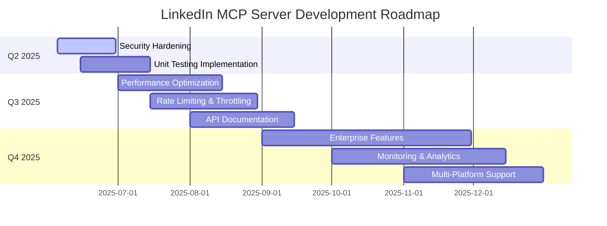

---

## 🔒 Security & Compliance Analysis

### Current Security Posture

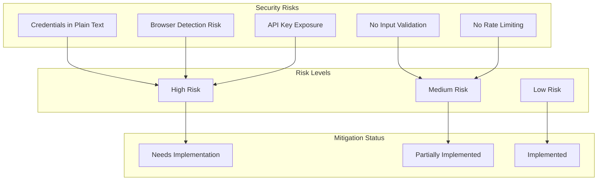

### Compliance Considerations

#### LinkedIn Terms of Service
- **Automated Access**: Current implementation may violate ToS
- **Rate Limiting**: No built-in respect for LinkedIn's limits
- **Data Usage**: Unclear compliance with data usage restrictions

#### Data Privacy (GDPR/CCPA)
- **Personal Data**: Email addresses and profile information collected
- **Consent**: No mechanism for user consent verification
- **Data Retention**: No defined retention policies
- **Right to Deletion**: No data deletion capabilities

---

## 🚀 Deployment & Operations Analysis

### Current Deployment Architecture

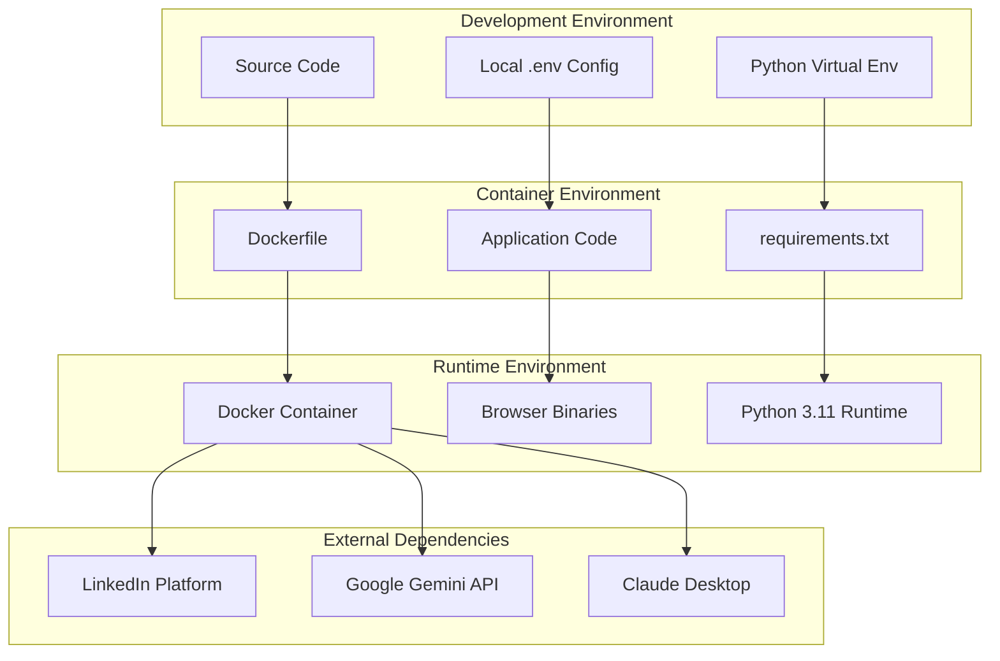

### Infrastructure Recommendations

#### Containerization Strategy
```yaml
# Recommended Docker Compose Setup
version: '3.8'
services:
  linkedin-mcp:
    build: .
    environment:
      - LINKEDIN_USERNAME=${LINKEDIN_USERNAME}
      - LINKEDIN_PASSWORD=${LINKEDIN_PASSWORD}
      - GOOGLE_API_KEY=${GOOGLE_API_KEY}
    ports:
      - "8000:8000"
    volumes:
      - ./logs:/app/logs
    restart: unless-stopped
    healthcheck:
      test: ["CMD", "curl", "-f", "http://localhost:8000/health"]
      interval: 30s
      timeout: 10s
      retries: 3
```

#### Cloud Deployment Options
1. **AWS ECS/Fargate**: Serverless container hosting
2. **Google Cloud Run**: Auto-scaling container platform
3. **Render**: Simple container deployment (current setup)
4. **Kubernetes**: Enterprise-grade orchestration

---

## 📊 Performance & Scalability Analysis

### Current Performance Characteristics

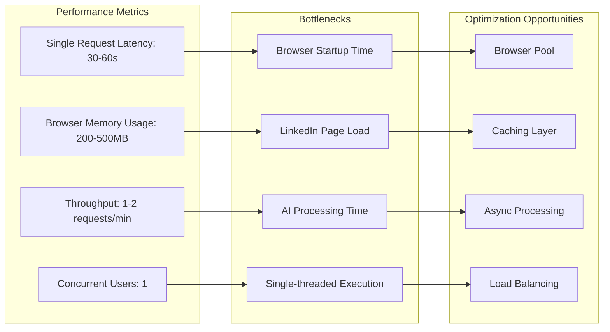

### Scalability Roadmap

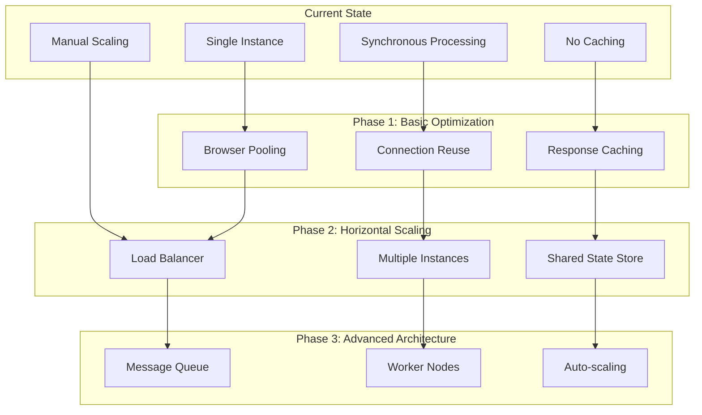

---

## 🧪 Testing & Quality Assurance

### Current Testing Coverage

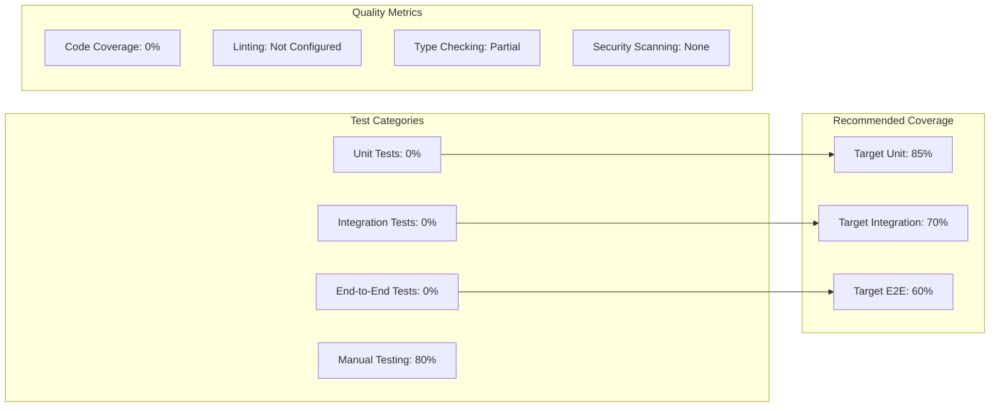

### Recommended Testing Strategy

```python
# Example Test Structure
tests/
├── unit/
│   ├── test_data_processor.py
│   ├── test_authentication.py
│   └── test_helper_functions.py
├── integration/
│   ├── test_linkedin_scraper.py
│   ├── test_gemini_integration.py
│   └── test_mcp_tools.py
├── e2e/
│   ├── test_full_workflow.py
│   └── test_error_scenarios.py
└── fixtures/
    ├── sample_linkedin_data.json
    └── mock_responses.py
```

---

## 📈 Monitoring & Observability

### Recommended Monitoring Stack

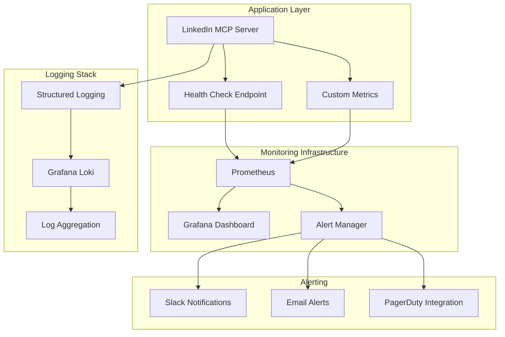

---

## 🔄 Integration & Ecosystem

### Current Integration Points

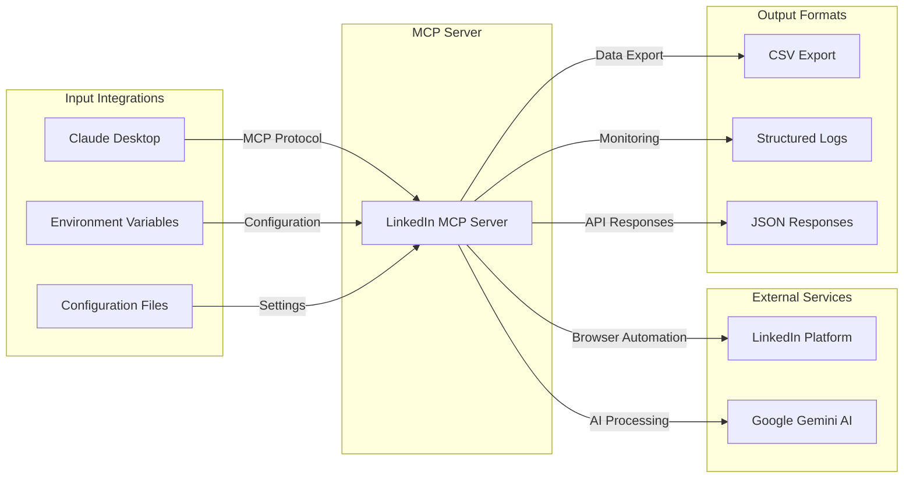

### Future Integration Opportunities

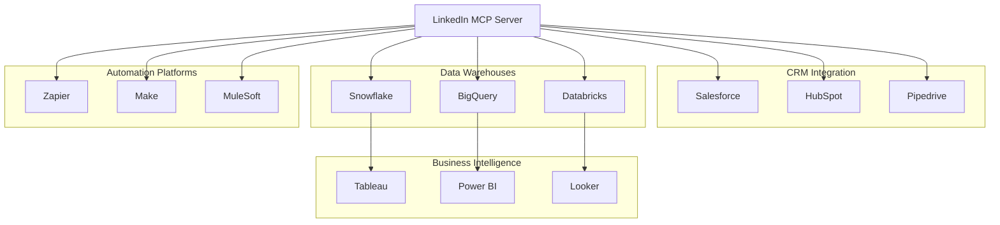

---

## 📋 Action Items & Recommendations

### Immediate Actions (Next 30 Days)

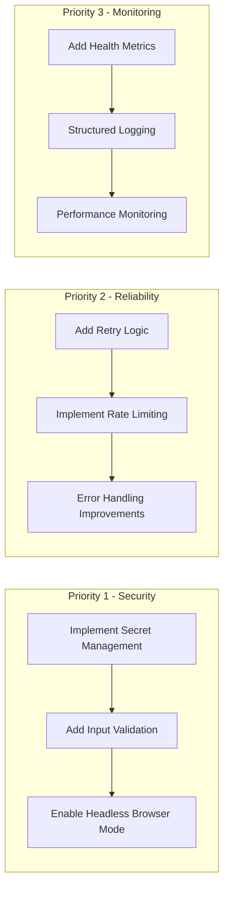

### Medium-term Goals (90 Days)

1. **Testing Infrastructure**
   - Unit test coverage > 80%
   - Integration test suite
   - Automated CI/CD pipeline

2. **Performance Optimization**
   - Browser connection pooling
   - Response caching
   - Async processing improvements

3. **Feature Enhancements**
   - Bulk processing capabilities
   - Advanced filtering options
   - Export format variety

### Long-term Vision (6-12 Months)

1. **Enterprise Features**
   - Multi-tenant architecture
   - Role-based access control
   - Advanced analytics dashboard

2. **Market Expansion**
   - Additional social platforms
   - API marketplace presence
   - Partner integrations

3. **AI Enhancement**
   - Custom model fine-tuning
   - Real-time data enrichment
   - Predictive analytics

---

## 🎯 Conclusion

The LinkedIn MCP Server represents a sophisticated and well-architected solution for automated LinkedIn data extraction. The codebase demonstrates strong technical foundations with comprehensive error handling, modern async patterns, and thoughtful separation of concerns.

### Key Strengths
- **Innovation**: Cutting-edge MCP protocol implementation
- **AI Integration**: Advanced Gemini AI for structured data extraction
- **Cloud Ready**: Production-grade containerization and deployment
- **Comprehensive Features**: Both comment and profile extraction capabilities

### Critical Success Factors
1. **Security Hardening**: Address credential management and compliance requirements
2. **Testing Implementation**: Establish comprehensive test coverage
3. **Performance Optimization**: Scale to handle enterprise workloads
4. **Market Compliance**: Ensure LinkedIn ToS compliance and data privacy

The repository is well-positioned for growth and enterprise adoption with proper investment in security, testing, and performance optimization initiatives.

---

*This analysis was conducted using comprehensive code review, architecture analysis, and industry best practices evaluation. Recommendations are prioritized based on risk assessment, business value, and technical feasibility.*
