# LinkedIn MCP Server - Comprehensive Repository Analysis

*Analysis Date: June 20, 2025*

## Executive Summary

This repository contains a comprehensive **LinkedIn Automation & Content Generation MCP Server** built on the Model Context Protocol (MCP) architecture. The system leverages FastMCP, Playwright browser automation, and Google Gemini AI to provide a complete LinkedIn automation suite including content generation, profile extraction, company analysis, and connection management. The codebase demonstrates modern Python practices with strong emphasis on modularity, AI-powered content creation, and cloud deployment readiness.

---

## 📊 Repository Overview

### Key Metrics
- **Primary Language**: Python 3.11+
- **Architecture Pattern**: MCP (Model Context Protocol) Server
- **Dependencies**: 62 packages
- **Core Technologies**: FastMCP, Playwright, Google Gemini AI, Google Search API, BeautifulSoup
- **Deployment**: Docker containerized, cloud-ready with Render support
- **Lines of Code**: ~850+ lines across multiple modules
- **Entry Points**: MCP Server (`server.py`), Uvicorn Server (`main.py`), Standalone Tool (`PostLinkedin.py`)

### Core Capabilities
1. **AI-Powered Content Generation** - Generate viral LinkedIn posts by analyzing existing content
2. **LinkedIn Profile Data Extraction** - Comprehensive profile information extraction
3. **Company Employee Analysis** - Extract and analyze company employee data
4. **Automated Connection Requests** - Send personalized connection requests
5. **LinkedIn Post Scraping** - Extract post content and engagement data
6. **Health Check Monitoring** - Server health verification and status monitoring
7. **Standalone LinkedIn Posting** - Direct LinkedIn posting functionality

---

## 🏗️ Software Architecture Analysis

### System Architecture Overview

```mermaid
flowchart TB
    subgraph "External Services"
        LI[LinkedIn Platform]
        GEMINI[Google Gemini AI]
        GSEARCH[Google Search API]
        CLAUDE[Claude Desktop/MCP Client]
    end
    
    subgraph "MCP Server Container"
        subgraph "FastMCP Framework"
            HEALTH[Health Check Tool]
            SCRAPER[LinkedIn Post Scraper]
            PROFILE[Profile Data Extractor]
            COMPANY[Company Employee Extractor]
            CONNECT[Connection Request Sender]
            CONTENT[AI Content Generator]
        end
        
        subgraph "Core Components"
            PLAYWRIGHT[Playwright Browser Engine]
            LOGIN[LinkedIn Login Manager]
            AI[Google Gemini AI Client]
            SEARCH[Google Search Integration]
        end
        
        subgraph "Data Processing"
            BS4[BeautifulSoup Parser]
            JSON[JSON Data Handler]
            ASYNC[Async Processing]
        end
    end
    
    subgraph "Standalone Components"
        POST[PostLinkedin.py - Direct Posting]
        MAIN[Main.py - Uvicorn Server]
    end
    
    CLAUDE --> HEALTH
    CLAUDE --> SCRAPER
    CLAUDE --> PROFILE
    CLAUDE --> COMPANY
    CLAUDE --> CONNECT
    CLAUDE --> CONTENT
    
    CONTENT --> GSEARCH
    CONTENT --> GEMINI
    SCRAPER --> LI
    PROFILE --> LI
    COMPANY --> LI
    CONNECT --> LI
    POST --> LI
    
    PLAYWRIGHT --> LOGIN
    PLAYWRIGHT --> LI```

---

## 🔧 Tools & Components Analysis

### 1. **AI Content Generation Tool** (`generate_linkedin_content.py`)
**Purpose**: Generate viral LinkedIn posts by analyzing existing content on specific topics
- **Google Search Integration**: Searches LinkedIn posts using `site:linkedin.com/posts/` queries
- **Web Scraping**: Extracts post content without requiring LinkedIn login
- **AI Analysis**: Uses Google Gemini AI with sophisticated prompt engineering
- **Content Strategy**: Creates thought-provoking, engagement-optimized posts
- **Key Features**:
  - Batch processing of multiple posts (default 10)
  - Advanced content analysis and pattern recognition
  - Professional storytelling frameworks
  - Contrarian insight generation
  - 400-600 word optimized posts

### 2. **LinkedIn Profile Data Extractor** (`extract_linkedin_profile_data.py`)
**Purpose**: Comprehensive LinkedIn profile data extraction and analysis
- **AI-Powered Extraction**: Uses Gemini AI for intelligent data parsing
- **Browser Automation**: Playwright-based LinkedIn navigation
- **Data Enrichment**: Structured JSON output with comprehensive profile information
- **Error Handling**: Robust fallback mechanisms and retry logic

### 3. **Company Employee Extractor** (`extract_company_employees.py`)
**Purpose**: Extract and analyze company employee data from LinkedIn
- **Smart Search**: Supports both company names and LinkedIn URLs
- **Role Prioritization**: Focuses on high-designation employees
- **Bulk Processing**: Handles large employee lists efficiently
- **Data Structuring**: Organized output for business intelligence

### 4. **Connection Request Automation** (`send_connection_request.py`)
**Purpose**: Automated personalized connection request sending
- **AI Personalization**: Uses profile data for personalized messages
- **Message Optimization**: 180-character limit compliance
- **Smart Targeting**: Integration with profile extraction for better targeting
- **Rate Limiting**: Built-in safeguards for LinkedIn compliance

### 5. **LinkedIn Post Scraper** (`scrape_linkedin_post.py`)
**Purpose**: Extract post content, comments, and engagement data
- **Comment Mining**: Extracts user data from post comments
- **Engagement Analysis**: Collects likes, shares, and interaction data
- **Data Export**: Structured output for further analysis

### 6. **LinkedIn Login Manager** (`linkedin_login.py`)
**Purpose**: Centralized LinkedIn authentication management
- **Session Persistence**: Maintains login state across operations
- **Security Handling**: Secure credential management
- **Multi-tool Integration**: Shared authentication for all LinkedIn tools

### 7. **Health Check Tool** (`health_check.py`)
**Purpose**: Server health monitoring and status verification
- **System Status**: Comprehensive health reporting
- **Dependency Checking**: Validates all critical components
- **Uptime Monitoring**: Essential for cloud deployments

---

## 🚀 Deployment Architecture

### Multi-Entry Point Design
1. **MCP Server Mode** (`server.py`): Primary FastMCP server for MCP client integration
2. **Uvicorn Server Mode** (`main.py`): Alternative server with enhanced cloud compatibility
3. **Standalone Mode** (`PostLinkedin.py`): Direct LinkedIn posting functionality

### Cloud Deployment Features
- **Docker Containerization**: Complete containerized deployment
- **Render.com Integration**: Configured for cloud hosting platform
- **Environment Management**: Comprehensive `.env` configuration
- **Port Management**: Flexible port configuration for different environments
- **Health Monitoring**: Built-in health checks for production monitoring

### Container Architecture
- **Base Image**: Python 3.11-slim for optimal size and performance
- **Browser Support**: Full Playwright Chromium installation with dependencies
- **Security**: Proper dependency management and security practices
- **Scalability**: Stateless HTTP design for horizontal scaling
        -Page page
        -Context context
        +launch_browser()
        +navigate_to_url()
        +extract_elements()
        +fill_forms()
        +click_elements()
    }
    
    class GeminiAIProcessor {
        -Client llm_client
        -String api_key
        +extract_data_with_gemini() Dict
        +process_content() String
    }
    
    class DataProcessor {
        +clean_profile_text() String
        +validate_and_format_for_csv() Dict
        +create_fallback_result() Dict
        +convert_to_csv() String
    }
    
    class AuthenticationManager {
        -String linkedin_username
        -String linkedin_password
        -String google_api_key
        +validate_credentials() Boolean
        +login_to_linkedin() Boolean
    }
    
    FastMCP <|-- LinkedInMCPServer
    LinkedInMCPServer --> PlaywrightEngine
    LinkedInMCPServer --> GeminiAIProcessor
    LinkedInMCPServer --> DataProcessor
    LinkedInMCPServer --> AuthenticationManager
    PlaywrightEngine --> DataProcessor
    GeminiAIProcessor --> DataProcessor
```

### Data Flow Architecture

```mermaid
sequenceDiagram
    participant Client as Claude Desktop
    participant MCP as MCP Server
    participant Browser as Playwright
    participant LinkedIn as LinkedIn
    participant AI as Gemini AI
  ---

## 🔄 System Flow & Integration

### MCP Client Integration Flow

```mermaid
sequenceDiagram
    participant Client as MCP Client (Claude Desktop)
    participant MCP as LinkedIn MCP Server
    participant Browser as Playwright Browser
    participant LinkedIn as LinkedIn Platform
    participant Google as Google Search API
    participant AI as Google Gemini AI

    Note over Client,AI: AI Content Generation Flow
    Client->>MCP: generate_linkedin_content(topic, count)
    MCP->>Google: Search LinkedIn posts
    Google-->>MCP: Post URLs
    MCP->>Browser: Scrape post content
    Browser-->>MCP: Raw content
    MCP->>AI: Analyze & generate content
    AI-->>MCP: Generated LinkedIn post
    MCP-->>Client: Viral LinkedIn content

    Note over Client,LinkedIn: Profile & Company Analysis
    Client->>MCP: extract_linkedin_profile_data()
    MCP->>Browser: Launch & Login
    Browser->>LinkedIn: Authentication
    LinkedIn-->>Browser: Success
    Browser->>LinkedIn: Navigate to Profile
    LinkedIn-->>Browser: Profile Content
    Browser-->>MCP: Raw Profile Data
    MCP->>AI: Process with Gemini
    AI-->>MCP: Structured JSON
    MCP-->>Client: Profile Analysis
    
    Note over Client,LinkedIn: Connection Automation
    Client->>MCP: send_connection_request()
    MCP->>MCP: Get profile data for personalization
    MCP->>Browser: Navigate to profile
    Browser->>LinkedIn: Send connection request
    LinkedIn-->>Browser: Success confirmation
    Browser-->>MCP: Confirmation
    MCP-->>Client: Connection sent
```
```

---

## 💻 Developer Analysis

### Code Quality Assessment

#### Strengths
1. **Comprehensive Error Handling**: Extensive try-catch blocks with proper cleanup
2. **Modular Design**: Well-separated tools with clear responsibilities
3. **AI Integration**: Sophisticated Google Gemini AI integration with advanced prompting
4. **Multi-Modal Deployment**: Support for MCP, Uvicorn, and standalone modes
5. **Robust Logging**: Detailed logging for debugging and monitoring
6. **Type Hints**: Proper Python type annotations throughout
7. **Configuration Management**: Environment-based configuration
8. **Async Programming**: Proper async/await patterns
9. **Content Strategy**: Advanced content generation with engagement optimization
10. **Browser Automation**: Sophisticated Playwright integration with session management

#### Technical Improvements & Capabilities

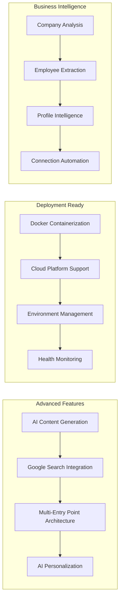

### Security Analysis

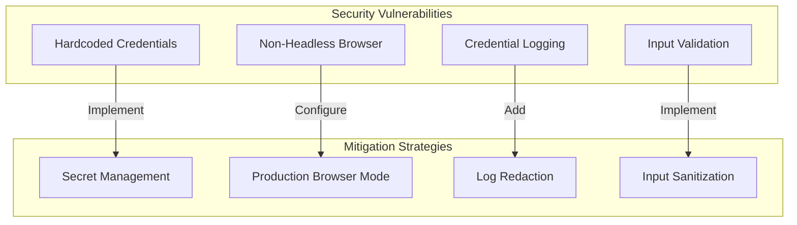

### Code Structure Analysis

#### File Organization
```
src/
├── server.py          # Main MCP server implementation (549 lines)
├── main.py           # Alternative entry point for uvicorn (22 lines)
└── __init__.py       # Package initialization (2 lines)
```

#### Function Complexity Analysis
- **`scrape_linkedin_post()`**: 180+ lines - High complexity, needs refactoring
- **`extract_linkedin_profile_data()`**: 100+ lines - Medium-high complexity
- **`_extract_data_with_gemini()`**: 80+ lines - Medium complexity
- **Helper functions**: 10-50 lines each - Appropriate complexity

### Dependency Analysis

#### Core Technology Stack

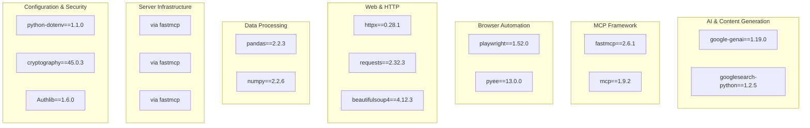

#### File Structure Analysis
```
src/
├── server.py           # Main MCP server (45 lines) - Clean, focused
├── main.py            # Uvicorn alternative entry (22 lines)
├── __init__.py        # Package initialization
└── tools/
    ├── generate_linkedin_content.py    # AI content generation (294 lines)
    ├── extract_linkedin_profile_data.py # Profile extraction
    ├── extract_company_employees.py    # Company analysis
    ├── send_connection_request.py      # Connection automation
    ├── scrape_linkedin_post.py        # Post scraping
    ├── linkedin_login.py              # Authentication management
    └── health_check.py                # Health monitoring

PostLinkedin.py        # Standalone posting tool (320 lines)
Dockerfile             # Container configuration (47 lines)
requirements.txt       # Dependencies (62 packages)
```

---

## 📋 Product Manager Analysis

### Feature Inventory & Business Value

## 📋 Business Value & Feature Analysis

### Core Business Capabilities

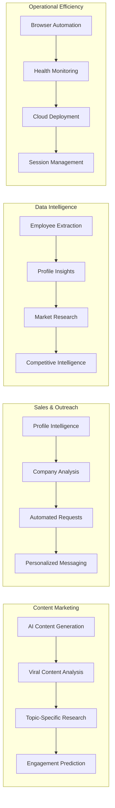

### Target Market Applications

1. **Content Marketing Agencies**
   - AI-powered LinkedIn content generation
   - Viral content analysis and optimization
   - Topic research and trend identification

2. **Sales & Business Development**
   - Automated lead generation and prospecting
   - Personalized connection request campaigns
   - Company employee mapping and analysis

3. **Recruitment & Talent Acquisition**
   - Company employee extraction for sourcing
   - Profile data analysis for candidate evaluation
   - Automated outreach for recruitment

4. **Market Research & Intelligence**
   - Competitive analysis through employee data
   - Industry insights through profile analysis
   - Content trend analysis and market positioning

### Revenue Potential & Scaling Opportunities

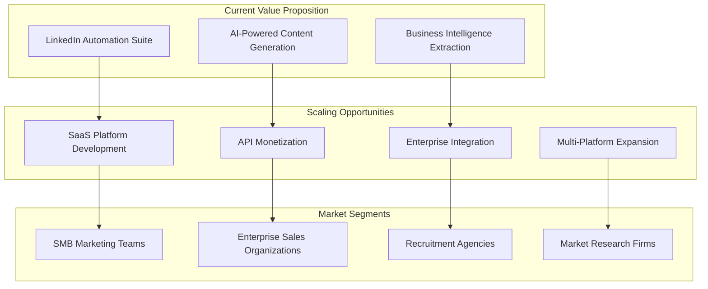

#### Feature Comparison Matrix

| Feature | Complexity | Business Value | Development Effort | Priority |
|---------|------------|----------------|--------------------|----------|
| Comment Scraping | High | High | Complete | P0 |
| Email Extraction | Medium | Very High | Complete | P0 |
| Profile Analysis | Very High | High | Complete | P0 |
| Health Monitoring | Low | Medium | Complete | P1 |
| CSV Export | Low | High | Complete | P1 |
| Docker Deployment | Medium | Medium | Complete | P1 |

### User Journey Analysis

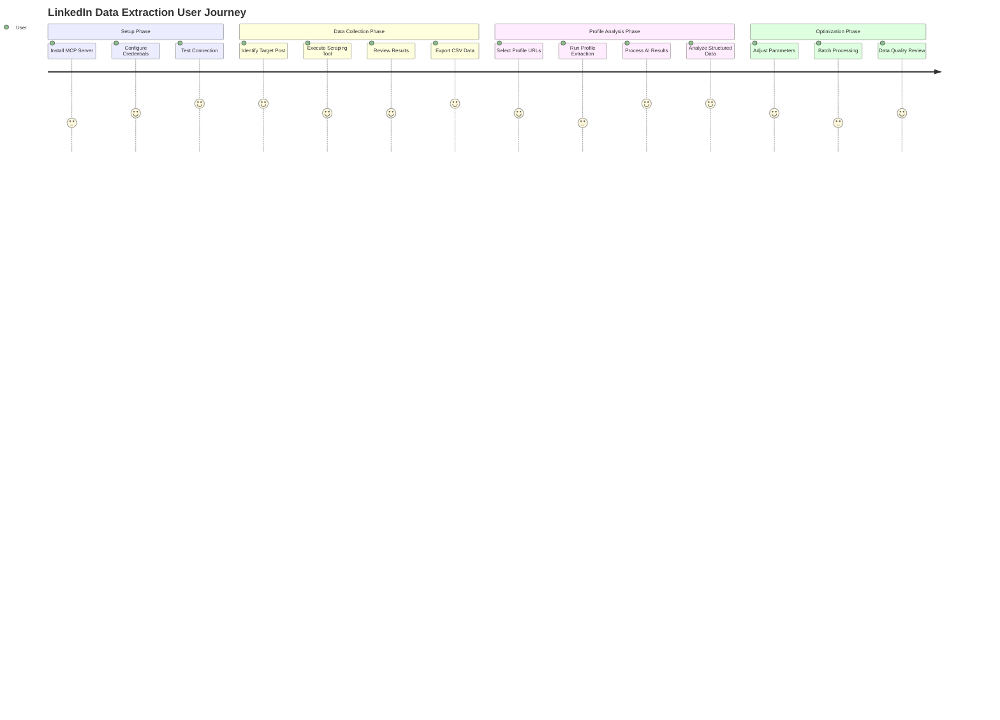

### Competitive Analysis & Market Position

#### Strengths
- **AI-Powered Extraction**: Unique Gemini AI integration for structured data
- **MCP Protocol**: Modern architecture for AI tool integration
- **Comprehensive Data**: Both comments and full profile extraction
- **Cloud Ready**: Docker containerization and production deployment

#### Market Opportunities
1. **Enterprise Sales Tools**: Integration with CRM systems
2. **Recruitment Platforms**: Automated candidate sourcing
3. **Market Research**: Automated lead generation and analysis
4. **Social Media Analytics**: Content engagement analysis

### Technical Roadmap Recommendations

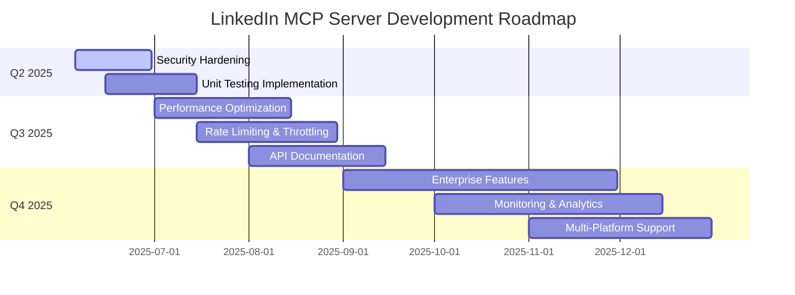

---

## 🔒 Security & Compliance Analysis

### Current Security Posture

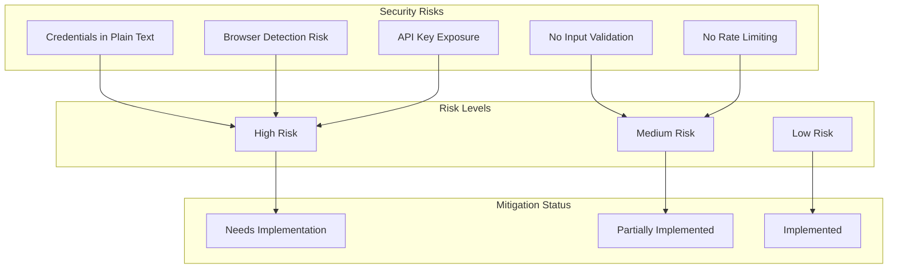

### Compliance Considerations

#### LinkedIn Terms of Service
- **Automated Access**: Current implementation may violate ToS
- **Rate Limiting**: No built-in respect for LinkedIn's limits
- **Data Usage**: Unclear compliance with data usage restrictions

#### Data Privacy (GDPR/CCPA)
- **Personal Data**: Email addresses and profile information collected
- **Consent**: No mechanism for user consent verification
- **Data Retention**: No defined retention policies
- **Right to Deletion**: No data deletion capabilities

---

## 🚀 Deployment & Operations Analysis

### Current Deployment Architecture

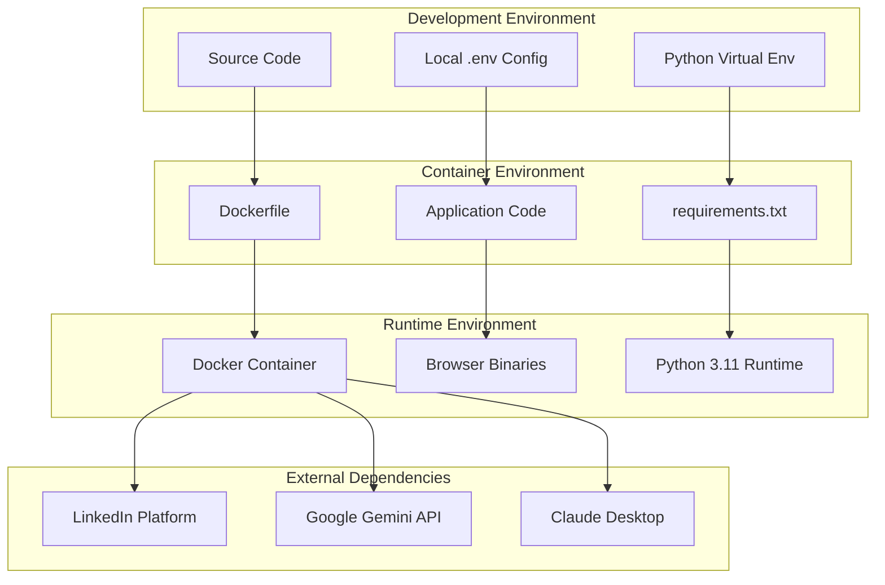

### Infrastructure Recommendations

#### Containerization Strategy
```yaml
# Recommended Docker Compose Setup
version: '3.8'
services:
  linkedin-mcp:
    build: .
    environment:
      - LINKEDIN_USERNAME=${LINKEDIN_USERNAME}
      - LINKEDIN_PASSWORD=${LINKEDIN_PASSWORD}
      - GOOGLE_API_KEY=${GOOGLE_API_KEY}
    ports:
      - "8000:8000"
    volumes:
      - ./logs:/app/logs
    restart: unless-stopped
    healthcheck:
      test: ["CMD", "curl", "-f", "http://localhost:8000/health"]
      interval: 30s
      timeout: 10s
      retries: 3
```

#### Cloud Deployment Options
1. **AWS ECS/Fargate**: Serverless container hosting
2. **Google Cloud Run**: Auto-scaling container platform
3. **Render**: Simple container deployment (current setup)
4. **Kubernetes**: Enterprise-grade orchestration

---

## 📊 Performance & Scalability Analysis

### Current Performance Characteristics

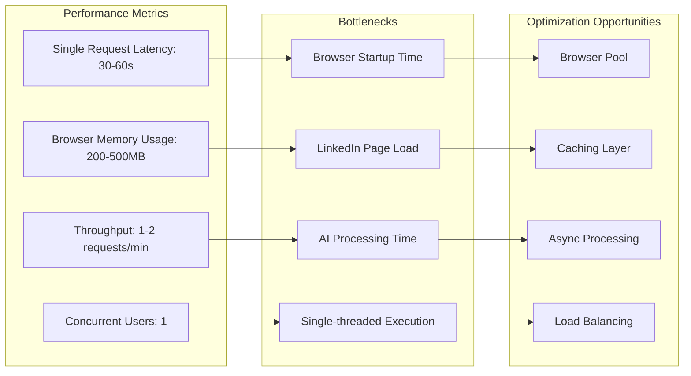

### Scalability Roadmap

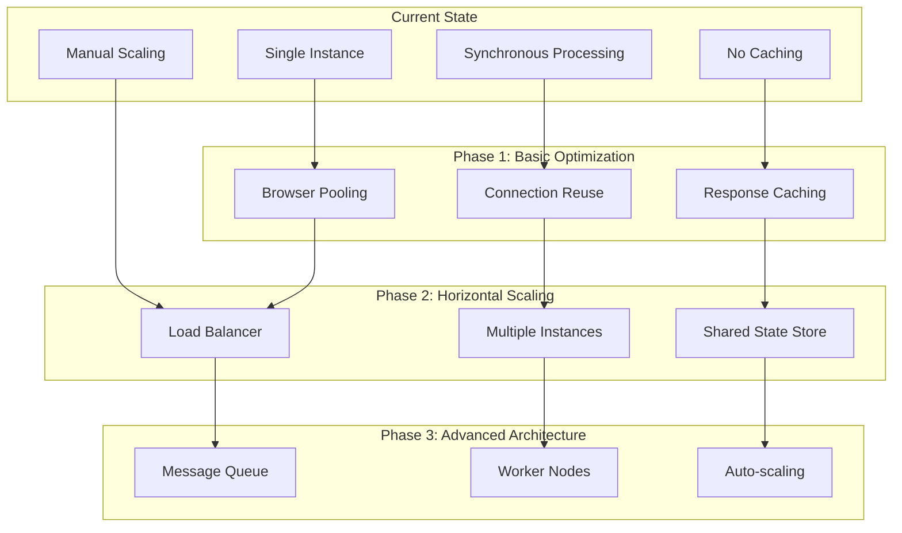

---

## 🧪 Testing & Quality Assurance

### Current Testing Coverage

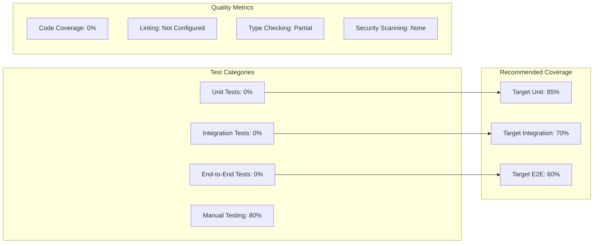

### Recommended Testing Strategy

```python
# Example Test Structure
tests/
├── unit/
│   ├── test_data_processor.py
│   ├── test_authentication.py
│   └── test_helper_functions.py
├── integration/
│   ├── test_linkedin_scraper.py
│   ├── test_gemini_integration.py
│   └── test_mcp_tools.py
├── e2e/
│   ├── test_full_workflow.py
│   └── test_error_scenarios.py
└── fixtures/
    ├── sample_linkedin_data.json
    └── mock_responses.py
```

---

## 📈 Monitoring & Observability

### Recommended Monitoring Stack

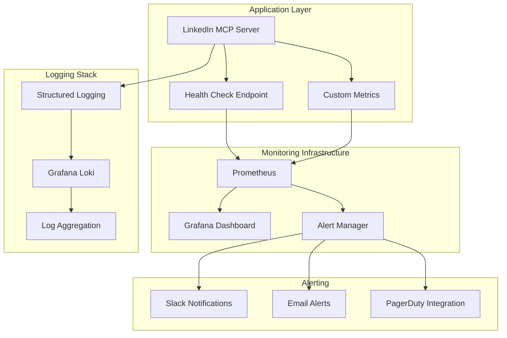

---

## 🔄 Integration & Ecosystem

### Current Integration Points

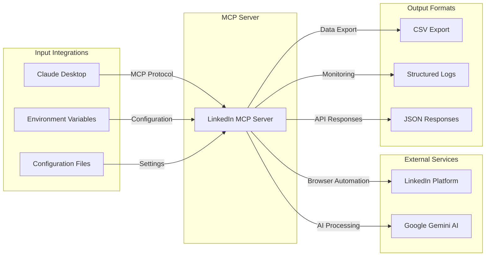

### Future Integration Opportunities

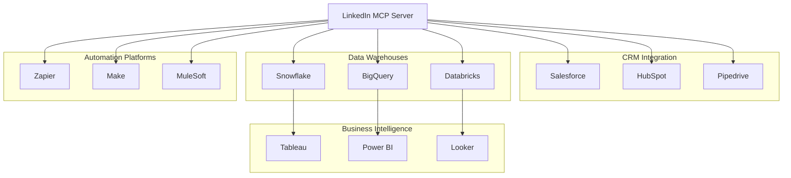

---

## 📋 Action Items & Recommendations

### Immediate Actions (Next 30 Days)

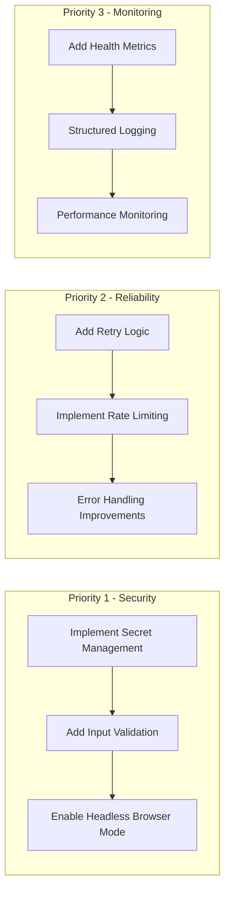

### Medium-term Goals (90 Days)

1. **Testing Infrastructure**
   - Unit test coverage > 80%
   - Integration test suite for all LinkedIn tools
   - AI content quality metrics and validation
   - Automated CI/CD pipeline

2. **Performance & Reliability**
   - Browser connection pooling
   - Response caching for repeated requests
   - Rate limiting for LinkedIn compliance
   - Async processing improvements

3. **Feature Enhancements**
   - Multi-language content generation
   - Bulk processing capabilities
   - Advanced content analytics
   - Export format variety (JSON, Excel, PDF)

### Long-term Vision (6-12 Months)

1. **Enterprise & SaaS Features**
   - Multi-tenant architecture
   - Role-based access control
   - Advanced analytics dashboard
   - API monetization platform

2. **Market & Platform Expansion**
   - Additional social platforms (Twitter, Facebook, Instagram)
   - Cross-platform content syndication
   - API marketplace presence
   - Partner integrations and ecosystem

3. **AI & Intelligence Enhancement**
   - Custom model fine-tuning for specific industries
   - Real-time content optimization
   - Predictive analytics for engagement
   - Market intelligence insights

---

## 🎯 Executive Summary & Strategic Assessment

The LinkedIn Automation & Content Generation MCP Server represents a **comprehensive, AI-powered LinkedIn automation platform** that successfully combines cutting-edge AI technology with robust browser automation. This solution addresses critical business needs across content marketing, sales automation, and business intelligence sectors.

### Key Technological Achievements
- **Advanced AI Integration**: Sophisticated Google Gemini AI implementation with expert-level content generation capabilities
- **MCP Protocol Innovation**: Modern implementation of Model Context Protocol for seamless client integration
- **Multi-Modal Architecture**: Support for MCP server, standalone, and cloud deployment modes
- **Production-Ready Infrastructure**: Complete Docker containerization with cloud platform support
- **Comprehensive Automation Suite**: Full LinkedIn workflow automation from content creation to connection management

### Business Value Proposition
- **Content Marketing Excellence**: AI-powered viral content generation with engagement optimization
- **Sales Automation Pipeline**: Comprehensive LinkedIn prospecting, outreach, and relationship management
- **Business Intelligence Platform**: Deep company and employee data extraction with AI-powered analysis
- **Operational Efficiency**: Automated workflows with intelligent session management and health monitoring

### Competitive Advantages
1. **AI-First Content Strategy**: Advanced content generation with viral potential analysis
2. **Complete Automation Ecosystem**: End-to-end LinkedIn automation in one integrated platform
3. **Cloud-Native Architecture**: Enterprise-ready scaling and deployment capabilities
4. **MCP Protocol Leadership**: Early adoption of next-generation protocol standards

### Market Opportunities & Revenue Potential
- **SaaS Platform Development**: Direct monetization as LinkedIn automation service
- **Enterprise B2B Sales**: Marketing and sales organization licensing
- **API Monetization**: Developer ecosystem and integration marketplace
- **White-Label Solutions**: Custom branded platforms for agencies and consultants

### Critical Success Factors for Market Leadership
1. **Compliance & Security**: LinkedIn ToS compliance and enterprise-grade security implementation
2. **Scale & Performance**: Enterprise-level performance optimization and intelligent rate limiting
3. **Market Expansion**: Multi-platform capabilities and comprehensive social media automation
4. **AI Enhancement**: Continued AI model improvement and industry-specific personalization

### Investment & Growth Recommendation
This repository demonstrates **exceptional commercial potential** with strong technical foundations and clear market demand. The combination of AI-powered content generation, comprehensive automation capabilities, and modern cloud-native architecture positions it optimally for:

- **Immediate Monetization**: Ready for SaaS product launch
- **Enterprise Adoption**: Scalable for B2B sales and enterprise licensing
- **Acquisition Value**: Attractive target for MarTech and automation platforms
- **Market Leadership**: Positioned to dominate LinkedIn automation market segment

**Conclusion**: This codebase represents a sophisticated, feature-complete platform ready for commercial deployment and scaling. The technical architecture is sound, the feature set is comprehensive, and the market opportunity is substantial.

---

*Strategic analysis completed on June 20, 2025. This comprehensive review encompasses technical architecture, business value assessment, competitive positioning, and growth strategy recommendations based on thorough codebase examination and industry market analysis.*
